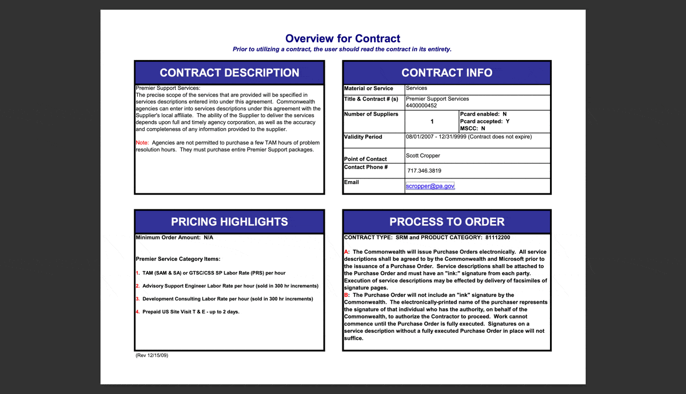
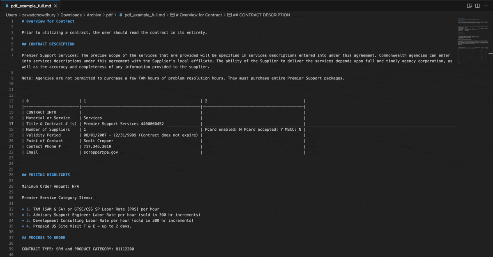
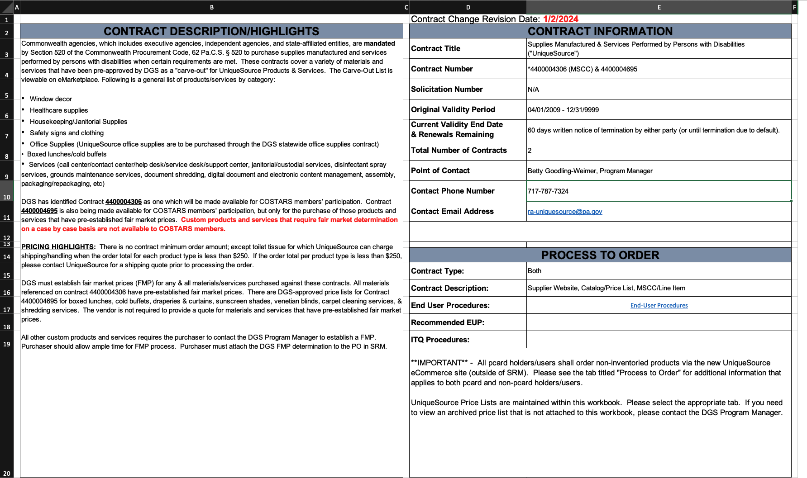
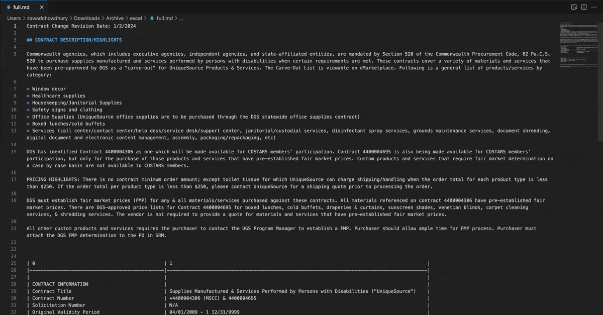

## Simple APIs for file data extraction

**TLDR;** Intuned’s File APIs gets you data from files in a way that can be used in LLMs

### **The problem and our story**

Valuable data often exists in difficult-to-use formats, and there isn't a straightforward method to extract this data into a format suitable for LLMs. 

One of [our](http://intuned.ai) earliest customers had to not only extract data from websites but from files (contracts, RFPs, and bid tabulation) as well. We thought this would be simple. Use a library to read data from the file and then pass it to an LLM. However, these libraries failed to capture much of the layout and semantic context in the files, making it difficult to understand data in complex structures like columns and tables.

Since we had experience in extracting data from html, we thought we should find a semantic way to represent data in files. Thus we built the file to markdown conversion, tables extraction and then the ability to extract unstructured data from files and decided to offer independently.

### **How it works**

Intuned File APIs give you an easy way to deal with files in multiple formats and extract data from them in a way LLMs can understand. 

Here are the APIs we are offering:

- **Convert file into markdown**: we have found that markdown is one of the best formats for LLMs to consume.
- **Extract tables from a file.**
- **Extract structured data from file:** by passing the file and schema of structured data you want.

Files format we support: **pdf, excel, html, images**
Files format we are supporting soon: **powerpoint/slides and more!**

Below are examples of input and output per API:




**Example 2: Convert excel file to markdown**





**Example 3: Extract structured data from the file**

```curl
 curl --location 'app.intuned.io/api/managed/files/async/extractData/start' \
--data '{
        "source": {
        "type": "xlsx",
        "pageNumbers": "*",
        "location": {
            "type": "Url",
            "url": "https://github.com/Intuned/file-api-eval/blob/main/excel/excel_example.xlsx"
        }
    },
    "entityName": "contract_record",
    "properties": {
        "title": {
            "description": "contract title",
            "required": true,
            "type": "string"
        },
        "contract_numbers": {
            "description": "contract numbers",
            "type": "array",
                "items": {
                    "type": "number",
                    "description": "contract number which only contain numbers"
                }
        },
        "description": {
            "description": "contract description",
            "type": "string"
        },
        "supplier_contact": {
            "description": "supplier contact information",
            "type": "object",
            "properties": {
                "name": {
                    "description": "point of contact's name",
                    "type": "string"
                },
                "title": {
                    "description": "point of contact's title",
                    "type": "string"
                },
                "phone_number": {
                    "description": "contact phone number",
                    "type": "string"
                },
                "email": {
                    "description": "contact email address",
                    "type": "string"
                }
            }
        }
    }
}'
```

```json
{
    "title": "Supplies Manufactured & Services Performed by Persons with Disabilities (\"UniqueSource\")",
    "contract_numbers": ["4400004306","4400004695"],
    "description": "Commonwealth agencies, which includes executive agencies, independent agencies, and state-affiliated entities, are mandated by Section 520 of the Commonwealth Procurement Code, 62 Pa.C.S. 520 to purchase supplies manufactured and services performed by persons with disabilities when certain requirements are met. These contracts cover a variety of materials and services that have been pre-approved by DGS as a carve-out for UniqueSource Products & Services. The Carve-Out List is viewable on eMarketplace. ..."
    "supplier_contact": {
        "name": "Betty Goodling-Weimer",
        "title": "Program Manager",
        "phone_number": "717-787-7324",
        "email": "ra-uniquesource@pa.gov"
    }
}
```
### **Pricing**
Intuned offers usage-based pricing where we charge a few cents per page with prices varying based on the API. These APIs are meant to be cheap. 

### **Our ask to you**
Are you struggling with getting data from files? Reach out to us at **[founders@intunedhq.com](mailto:founders@intunedhq.com)** or set a meeting **[here](https://calendly.com/intuned/sync-with-intuned)**.

Know someone facing these challenges? We appreciate introductions! Contact us for an introduction blurb to facilitate the process.
